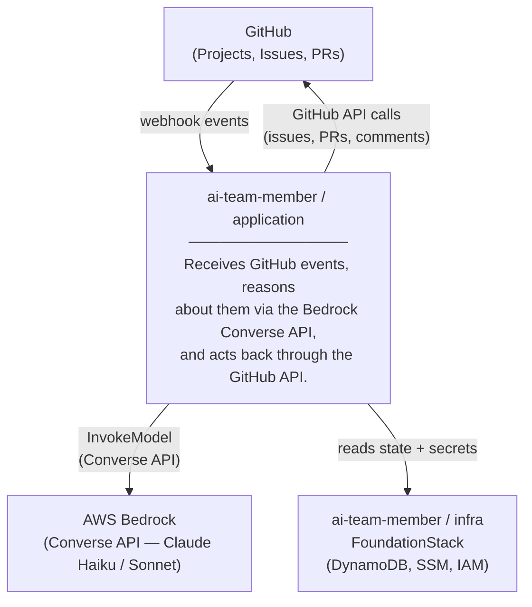

# C4 — Context

## System Context

## Actors and Systems

| Actor / System | Description |
|---|---|
| GitHub | Source of webhook events (issues, PRs, project board). Target of API calls for story creation, PR submission, and comment posting. |
| AWS Bedrock | Provides the Converse API. The application drives the reasoning loop directly — sending events, receiving tool call requests, executing tools, and returning results until the model reaches a conclusion. |
| FoundationStack | Provides DynamoDB (conversation state), SSM parameters (GitHub PAT, webhook secret), and shared IAM execution role. Owned by the infra project. |
