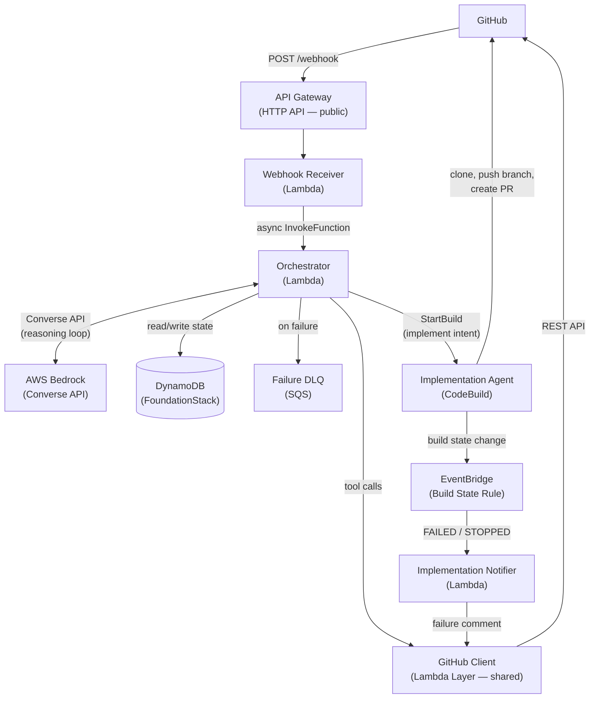

# C4 — Container

## Containers

## Container Descriptions

| Container | Technology | Responsibility |
|---|---|---|
| API Gateway | HTTP API | Public entry point. Enforces rate limiting (10 req/s, 50 burst). |
| Webhook Receiver | Lambda — ARM/Node.js | Validates HMAC signature, normalizes payload to internal `WebhookEvent` schema, async-invokes the Orchestrator Lambda and immediately returns 200. |
| Orchestrator | Lambda — ARM/Node.js (15-min timeout) | Drives the Bedrock Converse API reasoning loop. Loads conversation history from DynamoDB, sends the event + domain tool definitions to the model, executes tool calls via the GitHub Client layer, and persists updated history. Also detects `implement` intent in directed comments and triggers the Implementation Agent via CodeBuild. |
| GitHub Client | Lambda Layer — Node.js | Shared Octokit wrapper used by the Orchestrator and Notifier. Handles GitHub App auth (JWT → installation token via SSM), rate limit backoff, and pagination. |
| Failure DLQ | SQS standard queue | Receives the event payload when the Orchestrator Lambda exhausts Lambda's built-in async retry (2 attempts). Configured as the Orchestrator's `onFailure` event destination. |
| Implementation Agent | AWS CodeBuild | Executes the full implementation workflow when triggered by the Orchestrator: fetches a GitHub App installation token, clones the target repo, runs the Bedrock implementation agent loop, pushes a feature branch, and creates a pull request. |
| EventBridge | Build State Change Rule | Filters CodeBuild build state change events for the implementation project. Routes `FAILED` and `STOPPED` events to the Implementation Notifier Lambda. |
| Implementation Notifier | Lambda — ARM/Node.js | Receives build failure/stopped events from EventBridge. Posts a failure comment on the originating GitHub issue with a link to the CodeBuild build logs. |

## Decisions

**EventBridge** was considered for initial event routing but dropped in favour of direct writes to avoid fan-out complexity. See [ADR 001](../adr/001-drop-eventbridge-direct-sqs.md). EventBridge is used in a targeted way for CodeBuild build state change routing (implementation agent failure notifications only).

**SQS queues + managed Bedrock Agents** were the original design but replaced by async Lambda invocation and the Bedrock Converse API. Three domain queues and three invoker Lambdas collapsed into one Orchestrator Lambda. Domain tools (MCP-style abstraction over GitHub) are defined inside the Orchestrator and called in-process by the tool loop, avoiding the Action Group / OpenAPI indirection that managed Bedrock Agents require.

**Implementation trigger mechanism** — the implementation agent is triggered via a comment directive (`@sdlc-agent-petty implement`) rather than issue assignment or a project board status change. See [ADR 001 — Implementation Trigger Mechanism](../../adr/001-implementation-trigger-mechanism.md).
