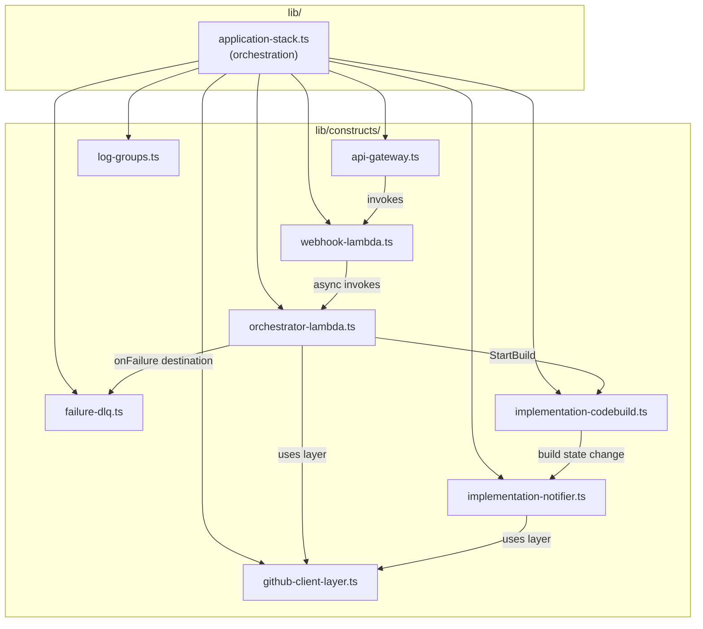

# C4 — Component

## Components

## Component Responsibilities

### `lib/application-stack.ts`
Thin orchestration layer. Instantiates all constructs and wires cross-construct dependencies and `FoundationStack` outputs (table name, SSM paths, execution role ARN) into them via props.

### `lib/constructs/api-gateway.ts`
HTTP API with:
- Single route: `POST /webhook` → Webhook Receiver Lambda
- Stage-level throttling: 10 req/s rate, 50 burst

### `lib/constructs/webhook-lambda.ts`
ARM Node.js Lambda that:
- Verifies `X-Hub-Signature-256` HMAC header against the webhook secret from SSM
- Normalizes the raw GitHub payload into the internal `WebhookEvent` schema
- Async-invokes the Orchestrator Lambda (`InvocationType: Event`) and returns 200 immediately

### `lib/constructs/orchestrator-lambda.ts`
ARM Node.js Lambda (15-minute timeout) that:
- Receives a normalized `WebhookEvent` from the Webhook Receiver
- Detects `implement` intent in directed issue comments and triggers the CodeBuild implementation agent
- Loads conversation history from DynamoDB keyed by repo + item number
- Runs the Bedrock Converse API tool loop: send messages + domain tool definitions → handle `toolUse` responses → execute tool via GitHub Client layer → send tool results → repeat until `endTurn`
- Persists updated conversation history to DynamoDB
- Has the GitHub Client layer attached and env vars for DynamoDB table, SSM param names, Bedrock model ID, and CodeBuild project name

### `lib/constructs/failure-dlq.ts`
SQS standard queue wired as the Orchestrator Lambda's `onFailure` async invocation event destination. Captures the full event payload when the Lambda fails after Lambda's built-in 2-attempt retry.

### `lib/constructs/log-groups.ts`
CloudWatch log groups for all Lambdas and the CodeBuild project. Retention set to 7 days, `DESTROY` removal policy. Covers: Webhook Receiver, Orchestrator, Implementation Agent (CodeBuild), and Implementation Notifier.

### `lib/constructs/github-client-layer.ts`
Lambda Layer containing the shared Octokit wrapper. Handles GitHub App authentication (JWT → installation access token via SSM-sourced App ID and private key), rate limit backoff, and response pagination. Attached to the Orchestrator and Implementation Notifier Lambdas.

### `lib/constructs/implementation-codebuild.ts`
AWS CodeBuild project that runs the implementation agent workflow:
- Source: `ai-team-member` GitHub repo (reads `buildspec.yml` from repo root)
- Triggered by the Orchestrator Lambda via `StartBuild` with issue/repo env var overrides
- IAM role scoped to SSM parameter reads and Bedrock `InvokeModel`
- On success: pushes a feature branch and creates a PR on the target repo, then posts the PR URL as an issue comment
- On failure/stopped: EventBridge routes the event to the Implementation Notifier

### `lib/constructs/implementation-notifier.ts`
ARM Node.js Lambda + EventBridge rule that:
- Listens for `FAILED` and `STOPPED` build state changes on the implementation CodeBuild project
- Extracts issue number and repo from the build's environment variables (passed via `StartBuild` overrides)
- Posts a failure comment on the originating GitHub issue with a link to the CodeBuild build logs
