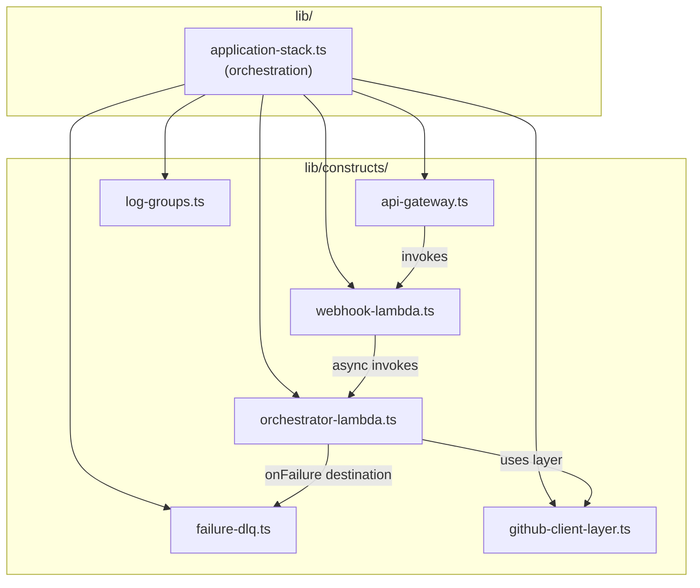

# C4 — Component

## Components

## Component Responsibilities

### `lib/application-stack.ts`
Thin orchestration layer. Instantiates all constructs and wires cross-construct dependencies and `FoundationStack` outputs (table name, SSM paths, execution role ARN) into them via props.

### `lib/constructs/api-gateway.ts`
HTTP API with:
- Single route: `POST /webhook` → Webhook Receiver Lambda
- Stage-level throttling: 10 req/s rate, 50 burst

### `lib/constructs/webhook-lambda.ts`
ARM Node.js Lambda that:
- Verifies `X-Hub-Signature-256` HMAC header against the webhook secret from SSM
- Normalizes the raw GitHub payload into the internal `WebhookEvent` schema
- Async-invokes the Orchestrator Lambda (`InvocationType: Event`) and returns 200 immediately

### `lib/constructs/orchestrator-lambda.ts`
ARM Node.js Lambda (15-minute timeout) that:
- Receives a normalized `WebhookEvent` from the Webhook Receiver
- Loads conversation history from DynamoDB keyed by repo + item number
- Runs the Bedrock Converse API tool loop: send messages + domain tool definitions → handle `toolUse` responses → execute tool via GitHub Client layer → send tool results → repeat until `endTurn`
- Persists updated conversation history to DynamoDB
- Has the GitHub Client layer attached and env vars for DynamoDB table, SSM param names, and Bedrock model ID

### `lib/constructs/failure-dlq.ts`
SQS standard queue wired as the Orchestrator Lambda's `onFailure` async invocation event destination. Captures the full event payload when the Lambda fails after Lambda's built-in 2-attempt retry.

### `lib/constructs/log-groups.ts`
CloudWatch log groups for the Webhook Receiver and Orchestrator Lambdas. Retention set to 7 days, `DESTROY` removal policy.

### `lib/constructs/github-client-layer.ts`
Lambda Layer containing the shared Octokit wrapper. Handles PAT authentication via SSM-sourced token, rate limit backoff, and response pagination. Attached to the Orchestrator Lambda.
