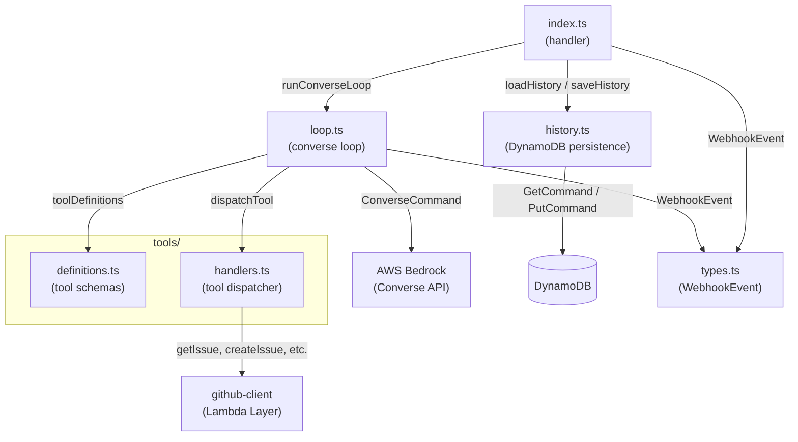

# C4 — Code (Orchestrator)

## Modules

## Module Responsibilities

| Module | Responsibility |
|---|---|
| `index.ts` | Lambda entry point. Reads `repo` and `itemNumber` from the event, loads conversation history, delegates to the converse loop, and persists updated history. |
| `loop.ts` | Drives the Bedrock Converse API reasoning loop. Builds the initial message from the `WebhookEvent`, sends it with tool definitions, handles `toolUse` response blocks by dispatching to handlers, and accumulates the full message history. Caps at 10 iterations. |
| `history.ts` | Loads and saves conversation history to DynamoDB. Key scheme: `pk = repo#<fullName>`, `sk = item#<number>`. |
| `types.ts` | Shared type definitions. `WebhookEvent` is the normalized payload received from the webhook receiver Lambda. |
| `tools/definitions.ts` | Static array of Bedrock `Tool` objects (name, description, input JSON schema) passed to every Converse API call. |
| `tools/handlers.ts` | Dispatches `toolUse` requests from the model to the corresponding `github-client` function. Returns serializable results or throws on unknown tool names. |
