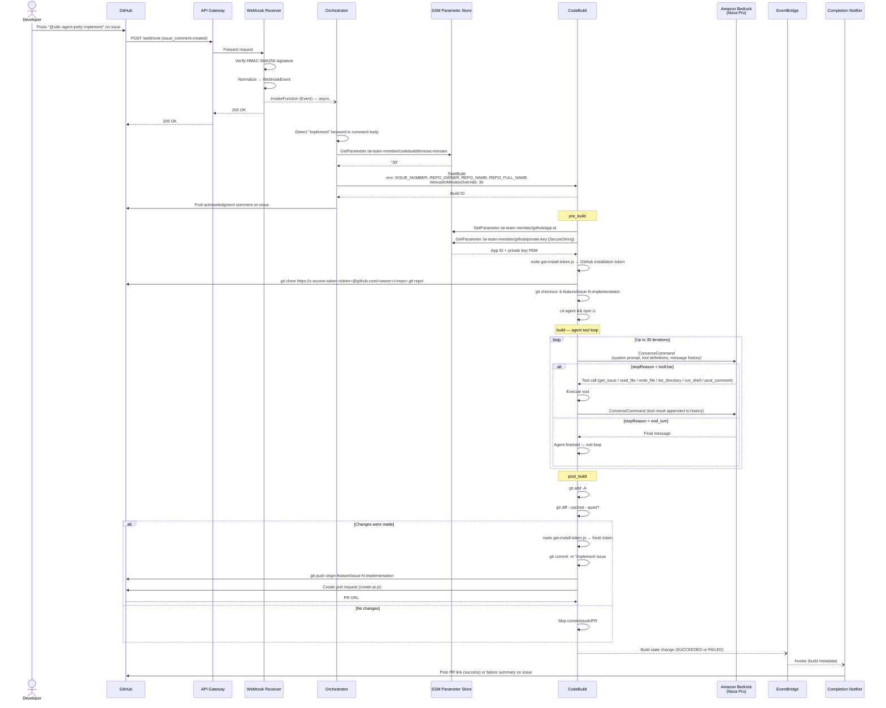
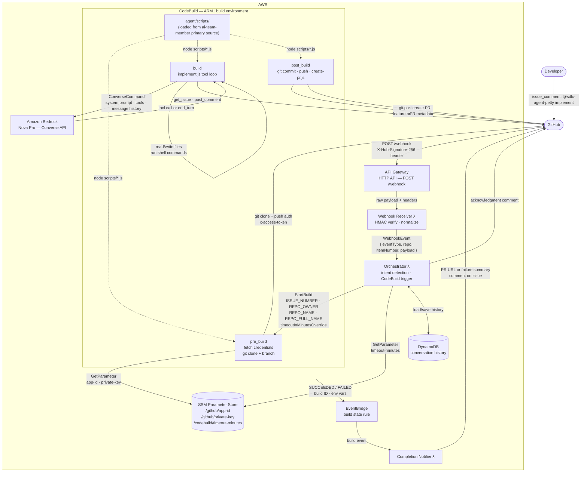

# Implementation Workflow

Triggered when a collaborator posts `@sdlc-agent-petty implement` on a GitHub issue. The agent checks out the target repository, implements the feature described in the issue, and submits a pull request.

See [ADR 001](../adr/001-implementation-trigger-mechanism.md) for trigger mechanism rationale.

---

## Sequence Diagram



---

## Data Flow Diagram

Shows the data passed between components at each stage of the workflow.



---

## Key Data Contracts

### WebhookEvent (Orchestrator input)

| Field | Type | Example |
|---|---|---|
| `eventType` | string | `issue_comment` |
| `repo.owner` | string | `michaelp1985` |
| `repo.name` | string | `my-project` |
| `repo.fullName` | string | `michaelp1985/my-project` |
| `itemNumber` | number | `42` |
| `senderIsBot` | boolean | `false` |
| `payload.comment.body` | string | `@sdlc-agent-petty implement` |

### CodeBuild Environment Variables

| Variable | Source | Purpose |
|---|---|---|
| `ISSUE_NUMBER` | StartBuild override | Target issue |
| `REPO_OWNER` | StartBuild override | Repository owner |
| `REPO_NAME` | StartBuild override | Repository name |
| `REPO_FULL_NAME` | StartBuild override | `owner/repo` — used for git clone URL |
| `GITHUB_APP_ID` | SSM (pre_build) | GitHub App authentication |
| `GITHUB_PRIVATE_KEY` | SSM (pre_build, SecureString) | GitHub App JWT signing |
| `GITHUB_TOKEN` | Derived (get-install-token.js) | Git HTTPS auth, Octokit calls |
| `BEDROCK_MODEL_ID` | Project env var | `us.amazon.nova-pro-v1:0` |
| `AGENT_SPEC_PATH` | Project env var | Path to `AGENT.md` in target repo |

### Feature Branch Convention

```
feature/issue-<ISSUE_NUMBER>-implementation
```

Pull request targets `main`. Branch is pushed to the **target repository**, not `ai-team-member`.

---

## Error Paths

| Failure point | Behaviour |
|---|---|
| HMAC verification fails | Webhook receiver returns 403; orchestrator never invoked |
| Orchestrator Lambda fails (×2 retries) | Event routed to SQS failure DLQ |
| CodeBuild: agent posts `post_comment` with blockers | Build exits cleanly; no PR created; comment visible on issue |
| CodeBuild: no file changes after tool loop | `git diff --cached --quiet` returns 0; post_build skips commit/push/PR |
| CodeBuild: build FAILED state | EventBridge triggers notifier; failure summary posted on issue |
| MAX_ITERATIONS (30) reached without `end_turn` | `implement.js` throws; CodeBuild marks build FAILED |
