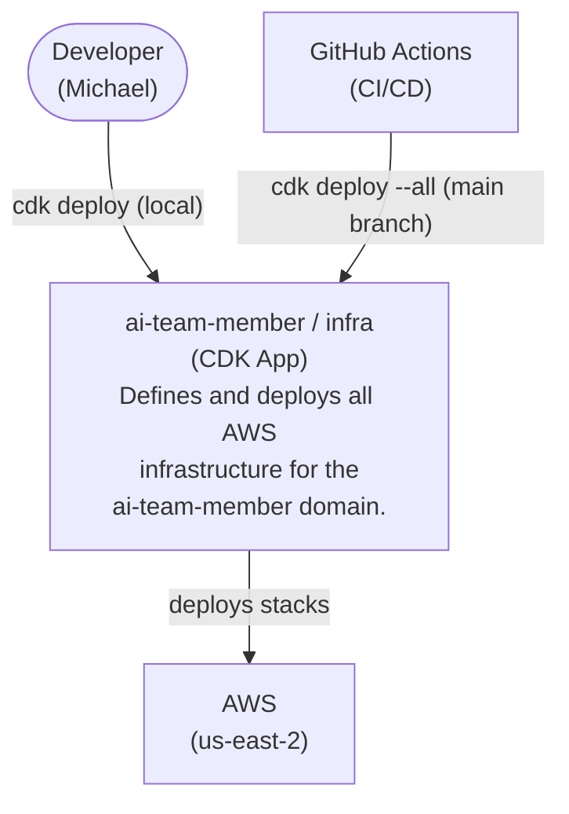

# C4 — Context

## System Context

## Actors

| Actor | Description |
|---|---|
| Developer | Runs CDK locally for development and debugging |
| GitHub Actions | Automated deployment on merge to `main` via OIDC role `github-actions-career-deploy` |
| AWS | Target environment where stacks are provisioned (us-east-2) |

## Deployment Role

GitHub Actions assumes `arn:aws:iam::REDACTED:role/github-actions-career-deploy` via OIDC. No long-lived credentials are stored. Role is scoped to `michaelp1985/Career`, `main` branch only.
