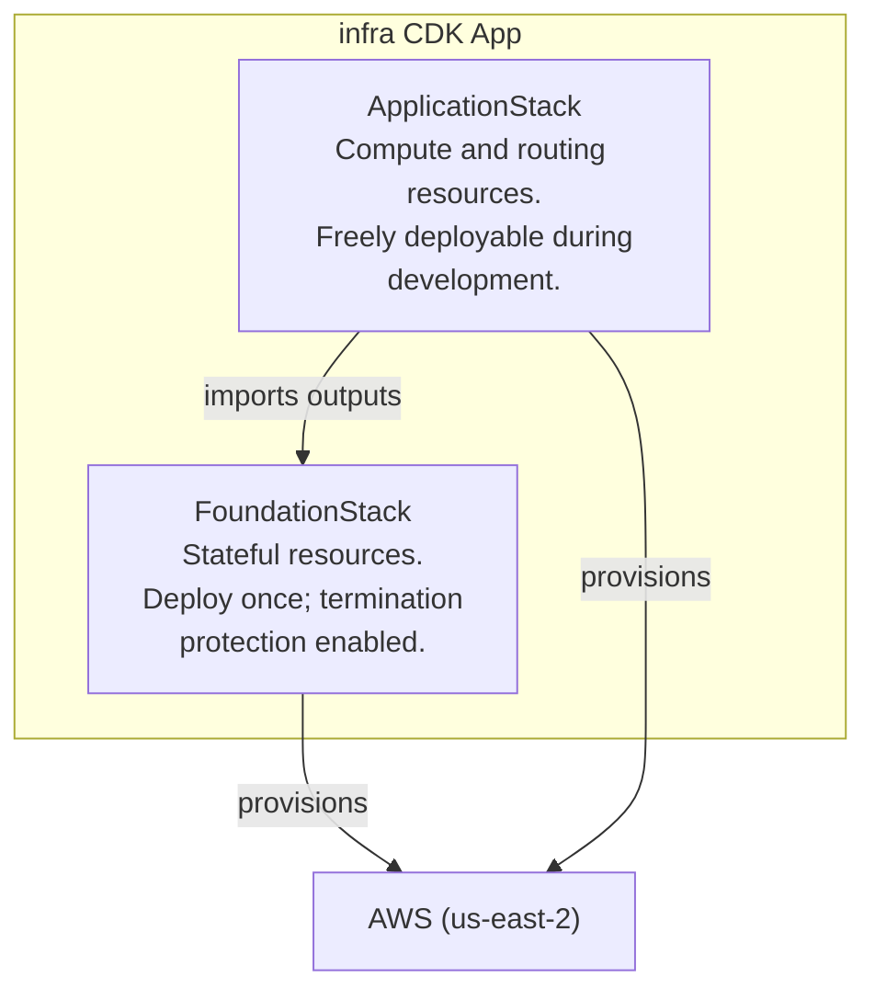

# C4 — Container

## Containers



## Stack Descriptions

| Stack | Deploy Frequency | Responsibility |
|---|---|---|
| `FoundationStack` | Rarely | Stateful resources — DynamoDB table, SSM parameters, shared IAM roles. Termination protection enabled. |
| `ApplicationStack` | Frequently | Compute and routing resources. Internal construct detail covered in the application project's C4 docs. |

## Cross-Stack References

`ApplicationStack` consumes outputs from `FoundationStack` at synth time:

| Output | Consumer |
|---|---|
| DynamoDB table name / ARN | Lambda environment variables |
| SSM parameter paths | Lambda environment variables (values fetched at runtime) |
| Shared execution role ARN | Lambda function role |

## Stack Dependency Order

```
FoundationStack  →  ApplicationStack
```

`cdk deploy --all` resolves and enforces this order automatically.
