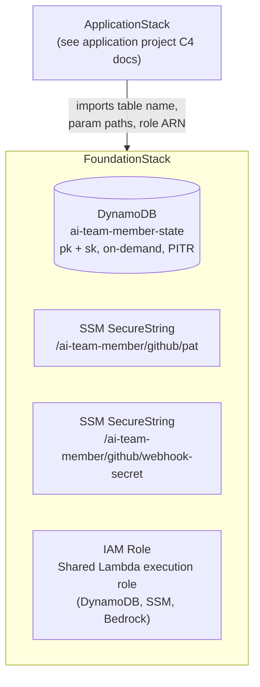

# C4 — Component

## Components

## Component Responsibilities

### `FoundationStack`

| Resource | Details |
|---|---|
| DynamoDB table | Partition key: `pk` (string), sort key: `sk` (string). On-demand billing. Point-in-time recovery enabled. |
| SSM `/ai-team-member/github/pat` | SecureString — GitHub Personal Access Token |
| SSM `/ai-team-member/github/webhook-secret` | SecureString — HMAC signing secret for webhook validation |
| Lambda execution role | Shared role for all application Lambdas; permits DynamoDB read/write, SSM GetParameter, Bedrock InvokeAgent |

### `ApplicationStack`
Thin orchestration layer — instantiates constructs defined in the application project and wires `FoundationStack` outputs into them via props. Internal construct detail is covered in the application project's C4 docs.
